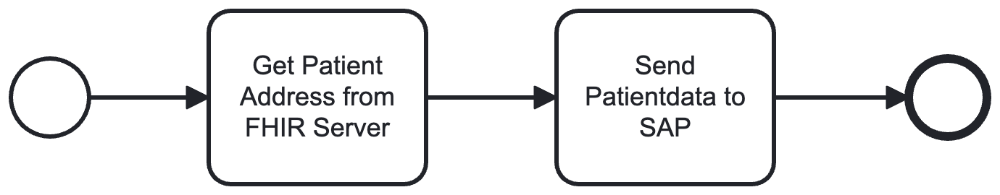
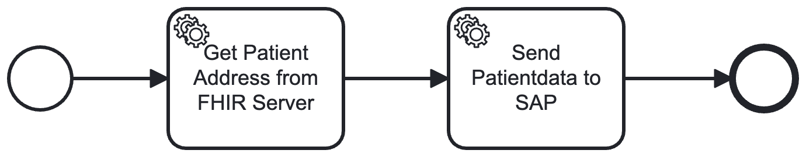
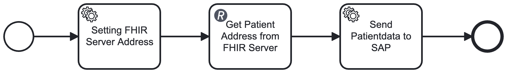

# Demo for integrating a Fhir ressource into Camunda Workflows

This demo is based on the following blog post: https://blog.akquinet.de/2024/11/25/camunda-under-fhir/

## The Demo process
The demo process definition is focussing of a typical integration task to fetch some patient data from a FHIR server to put it into a third party system like SAP.

We will implement this process with two different approaches for integrating a FHIR server in to a camunda workflow automation.

* Implementing a job handler by using the popular HAPI Fhir client (https://hapifhir.io) 
* A no code solution with the provided camunda REST connector

## How to run the examples

To run the demo successfully the following requirements have to be met:
* Java 21 installed
* A running Docker daemon 
* Installed and running Camunda 8 Run instance (for the REST connector example)

### Camunda 8 Run
Camunda 8 Run is a simple and lightweight Camunda 8 distribution for a local developer environment.
To download and install Camunda 8 run please have a look into this documentation: https://docs.camunda.io/docs/self-managed/setup/deploy/local/c8run/#install-and-start-camunda-8-run

## Build and Run the testcases

    $./mvnw clean install

This will build the project and run all the test cases. These test cases will deploy, start the process instances
and will do some assertions.

## Hapi Fhir solution
This approach does rely on implementing a customized job handler which does the data exchange with a FHIR server. 
We rely in this example on HAPI a very common FHIR library in the java ecosystem.

Our process definition consists of two service tasks. The first one is responsible to fetch some patient data from
a Fhir server and populate the data as process variables.
The second service task simulates to write the patient data into another 3rd party system like SAP
(for demo purposes it does log out the patient data only).

This process application does contain the following features and can be a good starting point for further investigations.
* SpringBoot and Kotlin based application deploying the example process definitions
* Providing Job Handler for implementing service task logic
* Service Bean for encapsulating the FHIR integration via HAPI library
* Processtest for evaluating the correct modeling of the process definition with mocked job handler. This is using the Zebee Process Test library (https://docs.camunda.io/docs/apis-tools/java-client/zeebe-process-test/)
* Full integration test relying on wiremock based abstraction of a real FHIR server
  The first test case does test the process in mocked environment. While the second test case is performing
  a full integration test. This is based on the new Camunda Process Test Framework (https://docs.camunda.io/docs/apis-tools/testing/getting-started/)

Process definition:
* [camunda_under_fhir_hapi.bpmn](src/main/resources/camunda_under_fhir_hapi.bpmn)

The test cases showcasing this particular approach:
* [ProcessHapiTest.kt](src/test/kotlin/de/akquinet/camunda/fhir/ProcessHapiTest.kt)
* [ProcessHapiIntegrationTest.kt](src/test/kotlin/de/akquinet/camunda/fhir/ProcessHapiIntegrationTest.kt)

## Camunda 8 REST connector solution
The following process definition does include the usage of the Camunda 8 REST connector involving configuration only.

We extended the process definition for additional service task to populate the URL for the FHIR server as a process variable for easier changeability.
For details have a look into the process definition:
* [camunda_under_fhir_connector.bpmn](src/main/resources/camunda_under_fhir_connector.bpmn)

The test cases showcasing this particular approach:
* [ProcessConnectorTest.kt](src/test/kotlin/de/akquinet/camunda/fhir/ProcessConnectorTest.kt)
* [ProcessConnectorIntegrationTest.kt](src/test/kotlin/de/akquinet/camunda/fhir/ProcessConnectorIntegrationTest.kt)

The first test case does test the process in mocked environment. While the second test case is performing
a full integration test.

The integration test for the Rest connector is not enabled by default. It does need a running Camunda 8 Run instance.
So after starting Camunda 8 run just start the integration test from your favorite IDE or by using the maven cli:

    $./mvnw test -Dtest=de.akquinet.camunda.fhir.ProcessConnectorIntegrationTest

